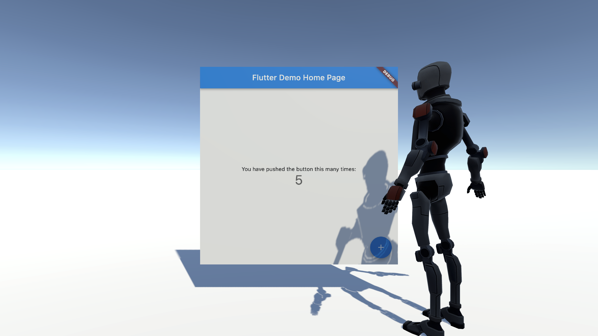

# Flutter in Unity

This is a small proof of concept showing Flutter embedded in Unity.

## Limitations

Right now this proof on concept only support macOS; rendering Flutter inside of
the Unity Editor and also in built applications.  It is using the Software
renderer but could be made to work with any backend.

Note: The version of Flutter you are using should be compatible with the FlutterEmbedder version used.

## Usage

In order to see the demo work you should be able to just open the `UnityProject`
project in Unity and hit the run button in the editor.

## How it works

First this project adds the Flutter embedder as a dynamic library that is loaded
by Unity at startup.  That way Unity has access to Flutter.  The Flutter project
we will load is precompiled into a bundle and placed in Unity's StreamingAssets
directory so that the project can be loaded at runtime.  There is also a native
Unity plugin that depends on the Flutter engine which will load up the project
from the StreamingAssets.  Finally, there is a MonoBehaviour that will
initialize and coordinate Unity with the plugin.

## Import files

- [//Plugin/src/plugin.mm](./Plugin/src/plugin.mm): The Unity native plugin that
  interoperates with the Flutter embedder.
- [//UnityProject/Assets/FlutterUnity/FlutterUnity.cs](./UnityProject/Assets/FlutterUnity/FlutterUnity.cs):
  The MonoBehaviour that communicates with the plugin.
- [//flutter_project/lib/main.dart](./flutter_project/lib/main.dart): The main
  source for the Flutter projects that is executed.

## Scripts

Inside the repo there are a handful of scripts that help put the correct
artifacts in the right place to make the project work.

- `//refresh_embedder.sh` - This will recompile a local version of the Flutter
  engine and place a dynamic library into the Unity project's assets.
- `//Plugin/refresh_plugin.sh` - This will recompile the unity native plugin
  that ties Unity to Flutter and place it in the Unity projects assets.
- `//flutter_project/refresh_app.sh` - This compiles the Flutter project and
  places it in the Unity projects streaming assets so it can be loaded at
  runtime.
- `//refresh.sh` - This runs all of the previous refresh scripts in order.
- `//./run_editor.sh` - This executes the Unity editor in the current shell so
  that the standard output can be seen.
